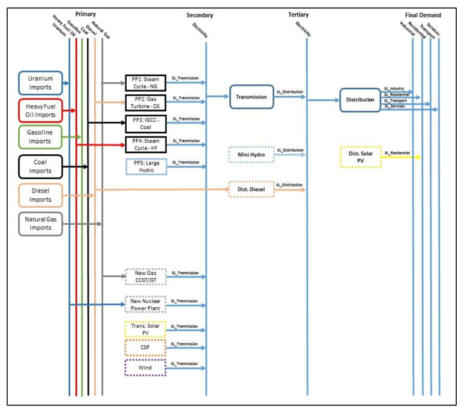

=================================
Create a model in OSeMOSYS
=================================
This section introduces the user to the basic components of any application of OSeMOSYS and describes the steps for the creation of a model. To this end, a sample case study, Atlantis, is used and examples from it are shown throughout the section. The concepts described here apply to any application, with due adjustments, and they are valid both in case interfaces are used or not. 

In the following subsections, `The Atlantis Case Study`_ describes the Atlantis sample case study for OSeMOSYS, representing a country sharing features of developed and developing ones. `How to build a model in OSeMOSYS`_ shows the step-by-step creation of a model without using interfaces.

The Atlantis Case Study
+++++++++++++++++++++++++++++
Atlantis is a country with a total population of 10 million people. 40% of the population lives in urban areas, distribute in 1.25 million households. The rest lives in rural areas, within 923 thousand households. The total population is expected to reach 15.9 million people by 2040 with an average annual growth rate of 1.8%. 

Currently, Atlantis imports 100% of its fuels. It relies on 5 power plant types to meet its electricity demand, each running on a single type of fuel: one large hydropower plant, natural gas-fired Single Cycle Steam Turbine, heavy fuel oil-fired Single Cycle Steam Turbine, diesel-fed Open Cycle Gas Turbine and coal-based Integrated Gasification Combined Cycle facility. Distributed diesel generators are the main source of electricity in many rural areas. 

Over the modelling period, this system will be expanded to explore the feasibility of including the following new technologies:

- wind turbines (25% load factor);

- mini hydro power plants (less than 1 MW);

- concentrated solar power plants (CSP);

- grid connected PV systems (Commercial);

- rooftop PV systems (in residential areas);

- a nuclear power plant (light water reactor);

- a new Combined Cycle Power Plant running on natural gas. 

The Atlantis input data file can be `accessed here <http://www.osemosys.org/uploads/1/8/5/0/18504136/atlantisdatafile_02_11.txt>`_

Mapping the RES of Atlantis
-----------------------------------
When developing a model using an optimization tool like OSeMOSYS, the energy/electricity system needs to be mapped to identify all the relevant technologies and fuels that will be involved in the analysis. The schematic representation of the system for such purposes is called Reference Energy System (RES). 

Figure 1 illustrates the RES of Atlantis, where the lines represent energy carriers (e.g., crude oil, coal etc.), while the blocks represent transformation technologies (e.g., power plants, transmission and distribution stations etc.). The RES can be read from the left to the right. On the left hand side, the primary energy resources are represented. They can be extracted domestically, imported or both. Extraction and import processes are represented as technologies in the RES (i.e. black boxes with outgoing lines representing the fuels they make available). Importantly, each chain must always start with a technology. Moving from the left to right, the energy carriers are transformed by different technologies, each with a user-defined transfer function, to ultimately meet the final demand for energy or services, presented by the lines on the far right hand side. 

   The Reference Energy System (RES) of the Atlantis case study.

How to build a model in OSeMOSYS
+++++++++++++++++++++++++++++++++++++

Downloading OSeMOSYS and GLPK
-----------------------------------
To develop an energy systems model using OSeMOSYS and optimize it using GLPSOL (GNU- Linear programming solver), we will need two different files: one OSeMOSYS code file and a data/model file representing the data corresponding to the model developed by the user. 

The OSeMOSYS code (both the long and short versions) can be downloaded from the `OSeMOSYS GitHub repository <https://github.com/KTH-dESA/OSeMOSYS/tree/master/OSeMOSYS_GNU_MathProg>`_ or the `OSeMOSYS website <http://www.osemosys.org/get-started.html>`_; the latter also contains older versions of the code. A data file corresponding to the Atlantis model described in the previous section `The Atlantis Case Study`_ can also be downloaded from the above-mentioned sources.

The latest version of the GNU-Linear Programming Kit (GLPK) which contains the solver GLPSOL can be downloaded `here <https://sourceforge.net/projects/winglpk/>`_. The Setup file on extraction will create a folder containing the necessary library files and GLPSOL. The folder can be extracted to any location (referred by ”...” in the sections below).  

The main steps to perform a model run are outlined in the following: 

1. *The OSeMOSYS model file and the Atlantis data file*
	Cut and paste the OSeMOSYS_201x_xx_x.txt and Atlantis.txt file into the .../GnuWin32/bin directory. (Remember that you set which directory this is after executing the glpk-xx.xx-setup.exe file.) 

2. *Open the command prompt*
	The command prompt can be opened by clicking in Windows on Start, Run, and then typing ‘cmd’. (There are other ways of doing this but the above mentioned procedure is one of the easiest.) The command prompt will have some text to indicate the current directory to which you can send ‘prompts’. If you are not in the same directory where GLPSOL is stored, you need to change the directory to the address that contains ‘glpsol.exe’ (.../GnuWin32/bin). If GLPK has been extracted to (the default) ‘program files’ folder, you will need to go to C:/Program Files/GnuWin32/bin.
	In case you are not sure about the current directory, return to the root directory by typing ”cd/” [#note1]_ . Then, navigate to the folder in which the files are stored by typing ”cd C:/.../GnuWin32/bin” then hit the return key (if you need help on command prompt, type ‘help’ and possible command options will be listed).

3. *Running the Atlantis example in OSeMOSYS using ‘glpsol’*
	Now that you are in the .../GnuWin32/bin directory in command prompt, and you have OSeMOSYS_201x_xx_x.txt and Atlantis.txt pasted in the same directory you can run the Atlantis example in OSeMOSYS. To do this type:

	**glpsol -m OSeMOSYS_201x_xx_xx.txt -d UTOPIA_201x_xx_.dat -o results.txt**

	All characters are important including space. This invokes a command (glpsol) to take the model file (OSeMOSYS_201x_xx_x.txt) and associated data input file (Atlantis.txt) to produce an output file with a full set of results (result.txt). The results file is particularly large, even for a simple problem. To easily comprehend the results, the OSeMOSYS code includes a few extra lines of code (not part of the optimization routine and available at the end of the code file) to produce a summary of results called SelectedResults.csv. This, as well as the full results file will appear in the .../GnuWin32/bin directory after the model run. A list of other possible command options can be found in the command prompt by typing glpsol –help.

4. *Errors*
	Glpsol will display an error message if it does not understand the input files, and prompt the line number where there is a conflict.

5. *Output*
	When glpsol is running successfully, it prints a status line. Each line will look similar to the following:

	\*4: \objval = 1.563750000e+002 \infeas = 0.000000000e+000 

	‘*’ means that a basic feasible solution has been found, ‘4:’ means that there have been 4 iterations to find a solution so far, ‘objval’ shows the current objective value, and ‘infeas’ shows the amount of infeasibility. When a feasible solution has been found, its value will be either 0 or a very small number. For more information on this please read the `documentation on GNU Linear Programming <http://www.osemosys.org/uploads/1/8/5/0/18504136/ceron_-_2006_-_the_gnu_linear_programming_kit,_part_1_-_introduction_to_linear_optimization.pdf>`_ by Rodrigo Ceron Ferreira. 

6. *Solution*
	To see the full solution, use a text editor to open results.txt. (For example, Notepad or Notepad++, see Section 4.2.5 on Supportive Programmer and Documentation). Recall that the solution file will be found in the directory .../GnuWin32/bin. The solution summary file is a comma separated file called SelectedResults.csv. A csv file can be conveniently opened in a spreadsheet and the ‘text to column’ tab can be used to delineate the data by using the ‘comma’ option as the delimiter. The selected results file produces tables of the following outputs. (The units indicated are specific to the Atlantis example. Other units may be defined by the user when setting up a new data file):

	- Total emissions, by type and region (emissions units, Mton)
	
	- Total costs, by region (currency units, m$)
	
	- The (time independent) demand for each: energy carrier (this is zero if no demand was entered), region and year (energy units, PJ)
	
	- The (time dependent) demand for each: energy carrier (this is zero if no demand was entered), time slice, region and year (energy units, PJ)
	
	
	- The (time dependent) production for each energy carrier timeslice, region and year (energy units, PJ)
	
	- The total annual capacity of each technology by region (capacity units, GW)
	
	- The new investment in capacity for each technology for each year by region (capacity units, GW)
	
	- The annual production by each technology of each energy source by region (energy units,GW)
	
	- The annual use by each technology of each energy source by region (energy units, PJ)
	
	- Annual emissions, by species and region (emissions units, Mton)
	
	- Annual emissions by technology, species and region (emissions units, Mton).\
	
If you have problems in running the files from the .../GnuWin32/bin directory (due to lack of administrative rights), redirect the OSeMOSYS code and data files to a different directory out of the C drive. 

Note that if the directory on the command prompt window is not same as .../GnuWin32/bin, then you need to write the complete path (e.g., C:/Users/user001/Documents/OSeMOSYS_201x_xx_x.txt) in the command Prompt or change to the new folder before running the model.

.. rubric:: 
.. [#note1] cd stands for *change directory*.

Creating an input file
------------------------------------------------------------
To create the input data for an optimization run, you can set up the model directly in a text editor like Notepad++. It is advisable to start with a small model and build it up step wise. This will simplify the debugging process (see following chapter in this manual on *Debugging a model*). It is further advisable to back up working versions of model data files by saving them in a folder of your choice. The Atlantis input file provided with the downloaded model code might serve as a useful starting point to see how data needs to be correctly formatted. Alternatively, LEAP has also proven useful to write an OSeMOSYS data file. 

Data and choices of units
------------------------------------------------------------
The cornerstone of a legitimate model is input data. Using accurate data, relevant model designs and a consistent choice of assumptions will ultimately offer better and more representative insights into the system. 
Typical data requirements include: 
- Energy demand for the activities that are considered in the model and an annual (hourly) load curve for the relevant demands; 

- Technology specific efficiencies, Electricity generation capacity, technology specific factors (capacity/availability), construction time, lifetime; 

- Technology costs (capital, fixed and variable O&M), Fuel costs (both local and imported costs);

- Resource potential (fossil fuel reserves, renewable energy potential), water availability for hydro power plants; 

- Emissions accounting and corresponding fuel specific emission factors.

Useful technology briefs containing such data have been developed by `ETSAP <http://iea-etsap.org/>`_. `The World Energy Outlook <http://www.iea.org/weo/>`_ from IEA, IEA Cost of Generating Electricity (look for latest publication at `www.iea.org <http://www.iea.org/>`_) and IRENA’s Renewable energy publications can further be used to obtain the required data for modelling a country’s energy sector. The fossil fuel reserves in every country can be obtained from EIA (U.S. Energy Information Administration) (5). The World Bank database is another useful source of data for energy demand. Note that these publications provide generic values, and data from national studies and strategy documents are usually preferred. 

For OSeMOSYS there are 4 units that needs to be chosen in a consistent manner. Bear in mind that certain default constraint levels, e.g., the total max capacity are set to values such as 999999. These limits can be violated if the choice of unit is too small (like kW for a large system, for which GW are recommendable). If a smaller unit is chosen, then the default values for certain parameters need to be increased in the model/data file

+-----------------+--------------------------------------------+
| Input variables | Possible choice of unit                    |
+=================+============================================+
| Energy          | GWh, MWh, PJ, GJ, etc.                     |
+-----------------+--------------------------------------------+
| Power           | GW, MW, etc.                               |
+-----------------+--------------------------------------------+
| Cost            | Million $, Million £, Million Euro, etc.   |
+-----------------+--------------------------------------------+
| Emission        | Mton                                       |
+-----------------+--------------------------------------------+

There is no unit conversion in OSeMOSYS: the modelling system assumes that all units are consistent. For example, the unit for capital costs needs to be coherent with the choice of units from the above table and is applied for all parameters relating to the costs. For example, when choosing GW and $ as power (capacity) and monetary units respectively, the capital cost has to be defined in Million $/GW. Similarly, if the energy unit is PJ, then the activity ratios and variable costs need to calculated with care to avoid errors. This is particularly important for the parameter **CapacityToActivityUnit** (1) (2), which depends on the final energy unit and the unit of capacity.

Supportive programmes and documentation
------------------------------------------------------------
The installation of Notepad ++ is recommended to work with and edit the model and data files. It can be downloaded `here <https://notepad-plus-plus.org/download/v7.5.4.html>`_. 

The following three files are recommended for more background documentation on the basics of GNU MathProg and the linear optimization logic applied in OSeMOSYS:

1.	`The GNU Linear Programming Kit, Part 1: Introduction to linear optimization <http://www.osemosys.org/uploads/1/8/5/0/18504136/ceron_-_2006_-_the_gnu_linear_programming_kit_part_1_-_introduction_to_linear_optimization.pdf>`_;

2.	`The GNU Linear Programming Kit, Part 2: Intermediate problems in linear programming <http://www.osemosys.org/uploads/1/8/5/0/18504136/ceron_2006_the_gnu_linear_programming_kit_part_2_intermediateproblemsinlinearprogramming.pdf>`_;

3.	`The GNU Linear Programming Kit, Part 3: Advanced problems and elegant solutions <http://www.osemosys.org/uploads/1/8/5/0/18504136/ceron_2006_the_gnu_linear_programming_kit_part_3_advancedproblemsandelegantsolutions.pdf>`_.

Further, as mentioned before, the most comprehensive description of how OSeMOSYS works is provided in :

1. `“OSeMOSYS: The Open Source Energy Modeling System, An introduction to its ethos, structure and development” <http://www.sciencedirect.com/science/article/pii/S0301421511004897>`_ by Howells et al. in 2011 

2. `“Modelling elements of Smart Grids – Enhancing the OSeMOSYS (Open Source Energy Modelling System) code” <https://www.sciencedirect.com/science/article/pii/S0360544212006299>`_ by Welsch et al. in 2012. 

It should be noted that the salvage value as described in `Howells et al. in 2011 <http://www.sciencedirect.com/science/article/pii/S0301421511004897>`_ is not applicable anymore: please see the `Change Log <http://www.osemosys.org/uploads/1/8/5/0/18504136/change_log_2017_11_08.pdf>`_ provided at `www.osemosys.org <http://www.osemosys.org>`_ for latest changes. Further, the description of storage in `Howells et al. in 2011 <http://www.sciencedirect.com/science/article/pii/S0301421511004897>`_ is not applicable any longer. Instead, refer to the current way of modelling storage or variability as described in `Welsch et al. in 2012 <https://www.sciencedirect.com/science/article/pii/S0360544212006299>`_. 
