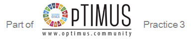

.. OSeMOSYS manual documentation master file, created by
   sphinx-quickstart on Fri Jan 26 11:24:54 2018.
   You can adapt this file completely to your liking, but it should at least
   contain the root `toctree` directive.

Welcome to the OSeMOSYS' documentation!
===========================================

   
   KTH - dESA, `www.osemosys.org <https://www.osemosys.org>`_

OSeMOSYS is an open source modelling system for long-run integrated assessment and energy planning. It has been employed to develop energy systems models from the scale of continents (African Power Pools, South America, EU28+2) down to the scale of countries, regions and villages. Designed to require no upfront financial investment, a fast learning curve and little time commitment to operate, it is fit for use by communities of developers, modellers, academics up to policy makers.
Thanks to its transparency, it is broadly employed as a training and dissemination tool.

The OpTIMUS Community
---------------------------------------------
OSeMOSYS is part of the OpTIMUS Community, Practice 3: Open Software, together with other world class, peer reviewed open source tools and data. 

OpTIMUS aims at promoting quantitative analysis to inform sustainable development policy, through the coordination of networks to advance open source software, knowledge development and capacity building. It is organized in three practices -modeling and capacity building for policy support, expert review and quality control, and software development. 
For more information on the OpTIMUS Community, please visit the related website: http://www.optimus.community/.

.. toctree::
   :maxdepth: 2
   :caption: Contents:
   
   manual/Introduction
   manual/Structure of OSeMOSYS
   manual/Code versions
   manual/Create a model in OSeMOSYS
   manual/Debugging a model
   manual/Advanced functionalities
   manual/References
   manual/Contacts
   manual/FAQ
   manual/License

Indices and tables
==================

* :ref:`genindex`
* :ref:`modindex`
* :ref:`search`
